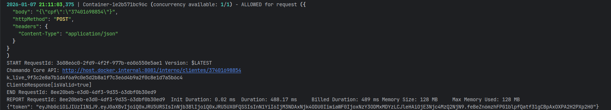
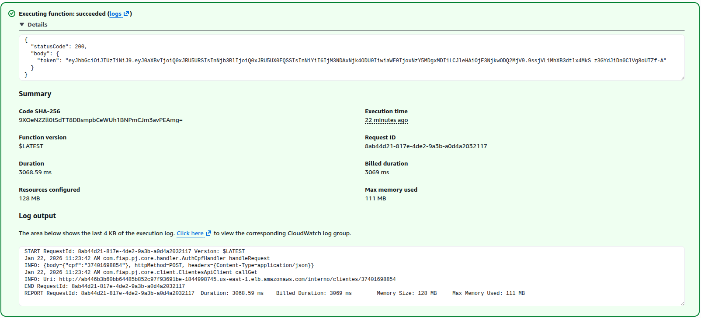

# 🛠 Lambda de Gerenciador de Oficina - Fase 3

[](https://openjdk.org/)
[](https://spring.io/projects/spring-boot)
[](https://maven.apache.org/)
[](https://aws.amazon.com/serverless/sam/)
[](https://junit.org/junit5/)
[](https://jwt.io/)
[](https://aws.amazon.com/lambda/)
[](https://www.docker.com/)
[](https://aws.amazon.com/eks/)
[](https://github.com/thomaserick/gerenciador-oficina-core-fase-2/actions/workflows/pipeline.yml)

Esta aplicação é uma **AWS Lambda (Function Serverless)** responsável por realizar a **autenticação de clientes via CPF
**, sem necessidade de usuário/senha.

A Lambda executa as seguintes responsabilidades:

- Validar o CPF informado;
- Consultar a API do **Core (Gerenciador de Oficina)** para verificar:
    - Existência do cliente;
    - Status do cliente;
- Gerar e retornar um **token JWT** válido para consumo das APIs protegidas do sistema.

Esta Lambda **complementa** o fluxo tradicional de autenticação por usuário/senha já existente no Core, sendo utilizada
exclusivamente para **consultas externas por CPF**.

---

## 🛠️ Tecnologias Utilizadas

- **Java 17**
- **AWS Lambda**
- **AWS SAM (Serverless Application Model)**
- **Maven**
- **JWT (JSON Web Token)**
- **API Gateway (HTTP)**
- **JUnit 5** (testes)
- **Docker** (execução local via SAM)

---

🚀 CI/CD Pipeline – GitHub Actions
A aplicação conta com um pipeline de CI/CD configurado via GitHub Actions, que realiza as seguintes etapas:

- Build e Testes automatizados
- Deploy automático da lambda na AWS

### Variaveis de Ambiente

A pipeline utiliza as seguintes variáveis de ambiente armazenadas como Secrets no GitHub:

| Nome                  | Descrição                                         |
|-----------------------|---------------------------------------------------|
| AWS_ACCESS_KEY_ID_    | Chave de acesso AWS                               |
| AWS_SECRET_ACCESS_KEY | Chave secreta AWS                                 |
| JWT_SECRET            | Chave secreta para assinatura dos tokens JWT      |
| CORE_API_URL          | URL base da API do Core (Gerenciador de Oficina)  |
| INTERNAL_API_KEY      | Chave de API para autenticação interna com o Core |

## ▶️ Execução Local

### ✅ Pré-requisitos

Certifique-se de ter instalado:

```bash
java -version     # Java 17
mvn -version      # Maven
sam --version     # AWS SAM CLI
docker --version  # Docker
```

## 🔧 Variáveis de Ambiente

Para executar a Lambda localmente, é necessário configurar as seguintes variáveis de ambiente no arquivo `env.json`:

- `CORE_API_URL`: URL base da API do Core (Gerenciador de Oficina).
- `JWT_SECRET`: Chave secreta para assinatura dos tokens JWT.
- `INTERNAL_API_KEY`: Chave de API para autenticação interna com o Core.

### 📄 Exemplo de `env.json`

```json
{
  "AuthCpfFunction": {
    "JWT_SECRET": "n7Q2zXE9+fR3GjG2Q1v9K2Wq4tYF8xX0Y0mK9P2qQ3w=",
    "CORE_API_URL": "http://host.docker.internal:8081",
    "INTERNAL_API_KEY": "k_live_9f3c2e8a7b1d4f6a9c0e5d2b8a1f7c3e6d4b9a2f0c8e1d7a5b6c4"
  }
}
```    

### 🚀 Executando a Lambda Localmente

Para executar a Lambda localmente usando o AWS SAM, utilize o seguinte comando:

Precisaamos subir a aplicação Gerenciador de Oficina Core localmente (via Docker ou IDE) para que a Lambda consiga se
comunicar com ela,
para validação do CPF e geração do token JWT.

```bash
 mvn clean package -DskipTests
 sam build --debug
 sam local invoke AuthCpfFunction --event event.json --env-vars env.json --add-host host.docker.internal:172.17.0.1 --debug
```

### Consumindo a Lambda Localmente via cURL

Após iniciar a Lambda localmente, você pode testá-la utilizando o comando `curl`:

```bash
curl -i -X GET "http://localhost:8081/interno/clientes/12345678909" \
  -H "X-API-KEY: k_live_9f3c2e8a7b1d4f6a9c0e5d2b8a1f7c3e6d4b9a2f0c8e1d7a5b6c4"
```

Substitua `12345678909` pelo CPF que deseja autenticar.
---

### Imagem da Requisição com retono do Token JWT

[](./docs/assets/req-lambda.png)

### Imagem da Requisição na AWS com retono do Token JWT

[](./docs/assets/req-lambda-aws.png)

## 🔗 Repositórios Relacionados — Fase 3

A arquitetura do **Gerenciador de Oficina — Fase 3** é composta por múltiplos módulos independentes, cada um versionado
em um repositório separado para facilitar a manutenção e o CI/CD.

| Módulo                           | Descrição                                                                                               | Repositório                                                                                                 |
|:---------------------------------|:--------------------------------------------------------------------------------------------------------|:------------------------------------------------------------------------------------------------------------|
| 🧱 **Core Application**          | Aplicação principal responsável pelas regras de negócio, APIs REST e integração com os demais módulos.  | [gerenciador-oficina-core-fase-3](https://github.com/thomaserick/gerenciador-oficina-core-fase-3)           |
| ⚡ **Lambda Functions**           | Conjunto de funções *serverless* para processamento assíncrono, notificações e automações event-driven. | [gerenciador-oficina-lambda-fase-3](https://github.com/thomaserick/gerenciador-oficina-lambda-fase-3)       |
| ☸️ **Kubernetes Infrastructure** | Infraestrutura da aplicação no Kubernetes, incluindo manifests, deployments, ingress e autoscaling.     | [gerenciador-oficina-k8s-infra-fase-3](https://github.com/thomaserick/gerenciador-oficina-k8s-infra-fase-3) |
| 🗄️ **Database Infrastructure**  | Infraestrutura do banco de dados gerenciado (RDS PostgreSQL), versionada e automatizada via Terraform.  | [gerenciador-oficina-db-infra-fase-3](https://github.com/thomaserick/gerenciador-oficina-db-infra-fase-3)   |
| 🌐 **API Gateway Infrastructure** | Infraestrutura do API Gateway com rate limiting, redirecionamento e monitoramento via Terraform. | [gerenciador-oficina-api-gateway-infra-fase-3](https://github.com/CaioMC/gerenciador-oficina-gateway-fase-3) |

> 🔍 Cada repositório é autônomo, mas integra-se ao **Core** por meio de pipelines e configurações declarativas (
> Terraform e CI/CD).
